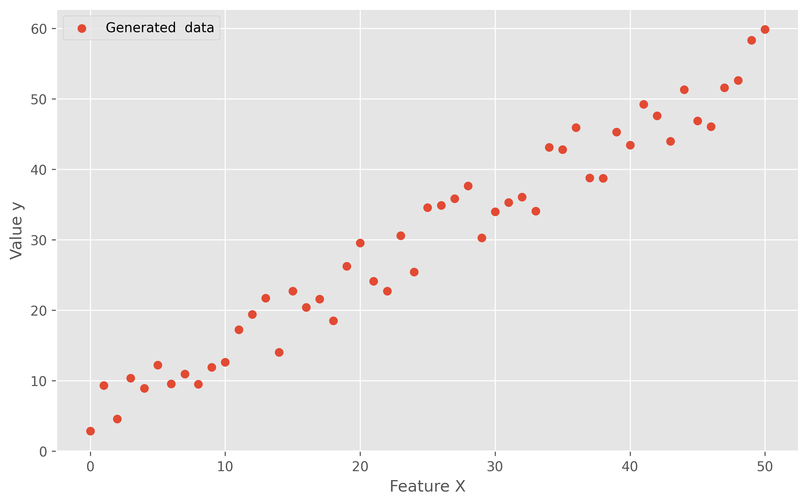
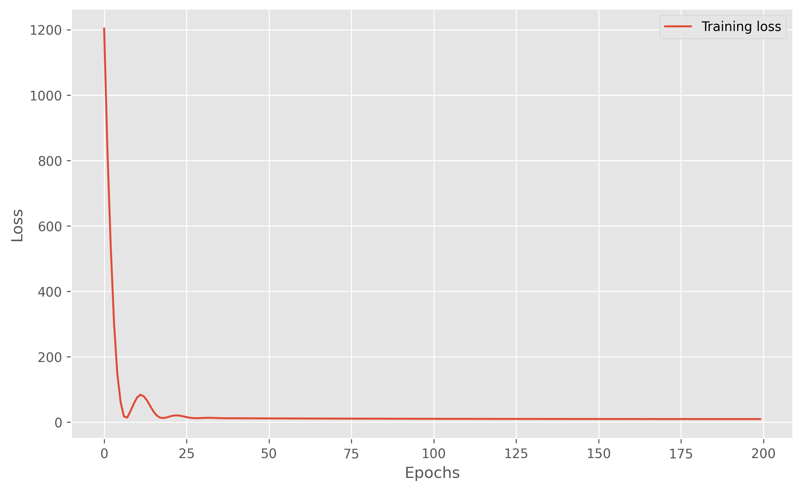
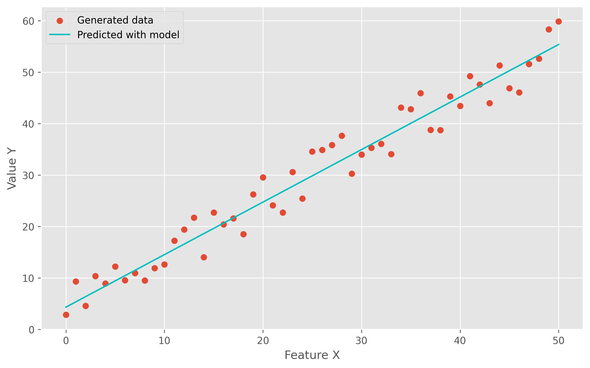
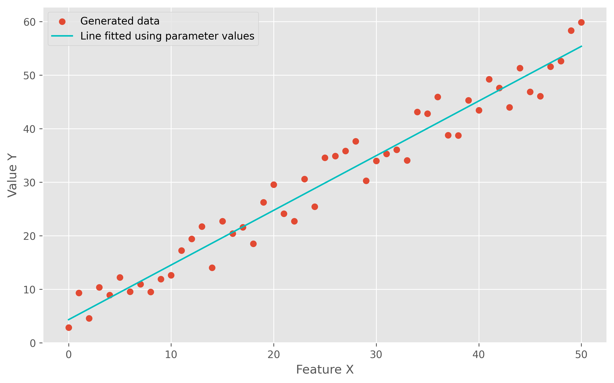

# Linear regression

A very simple approach to perform a linear regression with a single neuron using Keras.

### Package import


```
import tensorflow as tf
import numpy as np
import matplotlib.pyplot as plt
plt.style.use("ggplot")
```

### Random data generation

We create our samples.


```
x = np.linspace(0, 50, 51)
x
```


    array([ 0.,  1.,  2.,  3.,  4.,  5.,  6.,  7.,  8.,  9., 10., 11., 12.,
           13., 14., 15., 16., 17., 18., 19., 20., 21., 22., 23., 24., 25.,
           26., 27., 28., 29., 30., 31., 32., 33., 34., 35., 36., 37., 38.,
           39., 40., 41., 42., 43., 44., 45., 46., 47., 48., 49., 50.])


And for each sample add some random noise for the $y$ value.


```
y = x + 10 * np.random.random((len(x)))
y
```


    array([ 4.59333333, 10.1888939 ,  3.10342612,  3.78295369, 10.57957367,
            8.31186454, 11.97466834,  8.38350117, 14.58165746, 12.7179244 ,
           16.04800824, 16.04253531, 17.7570093 , 15.36504093, 23.32077078,
           19.38063338, 25.72030949, 20.81364232, 18.55875267, 25.1340618 ,
           28.48036   , 21.73467374, 30.81790828, 28.56736033, 28.83225669,
           28.18684725, 34.95836113, 29.90731219, 30.90521404, 38.67280311,
           33.28501437, 40.01292045, 33.16216509, 34.99748693, 35.87077378,
           35.66317699, 36.37898628, 42.26194454, 47.36216501, 45.62434907,
           46.47169133, 48.05329522, 45.83970327, 50.68483177, 53.01284414,
           54.96997999, 46.42993498, 50.41667051, 53.26256812, 58.97071734,
           55.3635401 ])


The generated data looks like this:


```
plt.figure(figsize=(10, 6), dpi=300)
plt.scatter(x, y, label="Generated  data")
plt.xlabel("Feature X")
plt.ylabel("Value y")
plt.legend()
plt.show()
```





### Modelling

The model has just a single neuron that will model the linear equation $y = mx + b$.

The trained weight will correspond to the slope $m$ of the equation and the bias to the intersection value $b$.


```
model = tf.keras.Sequential()
model.add(tf.keras.layers.Input(shape=[1]))
model.add(tf.keras.layers.Dense(1))
model.compile(loss="mean_squared_error", optimizer=tf.keras.optimizers.Adam(0.1))
```


```
model.summary()
```

    Model: "sequential"
    _________________________________________________________________
    Layer (type)                 Output Shape              Param #   
    =================================================================
    dense (Dense)                (None, 1)                 2         
    =================================================================
    Total params: 2
    Trainable params: 2
    Non-trainable params: 0
    _________________________________________________________________


We proceed to fit the model.


```
history = model.fit(x, y, epochs=200)
```

    Epoch 1/200
    2/2 [==============================] - 0s 4ms/step - loss: 653.8051
    Epoch 2/200
    2/2 [==============================] - 0s 2ms/step - loss: 399.1392
    Epoch 3/200
    2/2 [==============================] - 0s 2ms/step - loss: 205.5257
    Epoch 4/200
    2/2 [==============================] - 0s 2ms/step - loss: 83.4503
    Epoch 5/200
    2/2 [==============================] - 0s 2ms/step - loss: 23.8983
    [... 190 epochs omitted ...]
    Epoch 196/200
    2/2 [==============================] - 0s 2ms/step - loss: 8.8897
    Epoch 197/200
    2/2 [==============================] - 0s 2ms/step - loss: 8.8889
    Epoch 198/200
    2/2 [==============================] - 0s 1ms/step - loss: 8.8904
    Epoch 199/200
    2/2 [==============================] - 0s 2ms/step - loss: 8.8932
    Epoch 200/200
    2/2 [==============================] - 0s 2ms/step - loss: 8.9216


And we can plot the loss during the training.


```
plt.figure(figsize=(10, 6), dpi=300)
plt.plot(history.history["loss"], label="Training loss")
plt.xlabel("Epochs")
plt.ylabel("Loss")
plt.legend()
plt.show()
```





### Model prediction

There are two ways to generate the adjusted model. The first one will be simlpy to use the `.predict()` method directly over the $x$ samples:


```
y_pred_model = model.predict(x)
```


```
plt.figure(figsize=(10, 6), dpi=300)
plt.scatter(x, y, label="Generated data")
plt.plot(x, y_pred_model, label="Predicted with model", color="c")
plt.xlabel("Feature X")
plt.ylabel("Value Y")
plt.legend()
plt.show()
```





The second (and my favorite) way is to understand the guts inside the network and access the information to literally replicate the model.

In this case we acces the first (and only) layer:


```
layer = model.get_layer(index=0)
layer
```


    <tensorflow.python.keras.layers.core.Dense at 0x7fe81910e828>


Then, we get and print the weights and biases:


```
weights = layer.get_weights()
weights
```


    [array([[1.0214125]], dtype=float32), array([4.3216815], dtype=float32)]


As we previously mentioned, the only weight will correspond to the slope and the bias to the intersection point. In order to replicate the linear equation we simply do:


```
m, b = weights[0][0], weights[1]
print(m)
print(b)
```

    [1.014319]
    [4.2396894]


```
y_pred_params = m * x + b
y_pred_params
```


    array([ 4.23968935,  5.25400829,  6.26832724,  7.28264618,  8.29696512,
            9.31128407, 10.32560301, 11.33992195, 12.35424089, 13.36855984,
           14.38287878, 15.39719772, 16.41151667, 17.42583561, 18.44015455,
           19.4544735 , 20.46879244, 21.48311138, 22.49743032, 23.51174927,
           24.52606821, 25.54038715, 26.5547061 , 27.56902504, 28.58334398,
           29.59766293, 30.61198187, 31.62630081, 32.64061975, 33.6549387 ,
           34.66925764, 35.68357658, 36.69789553, 37.71221447, 38.72653341,
           39.74085236, 40.7551713 , 41.76949024, 42.78380919, 43.79812813,
           44.81244707, 45.82676601, 46.84108496, 47.8554039 , 48.86972284,
           49.88404179, 50.89836073, 51.91267967, 52.92699862, 53.94131756,
           54.9556365 ])


```
plt.scatter(x, y, label='Generated data')
plt.plot(x, y_pred_params, label='Line fitted using parameter values', color='c')
plt.legend()
plt.show()
```




If you want to run the code above directly on Google Colab, please follow [this link](https://colab.research.google.com/drive/1zC47uLBWbc2BOPlwxFAxENTxc7irVCND?usp=sharing).
