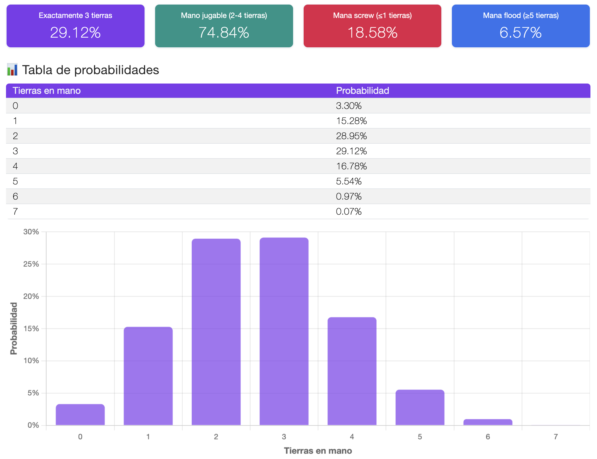
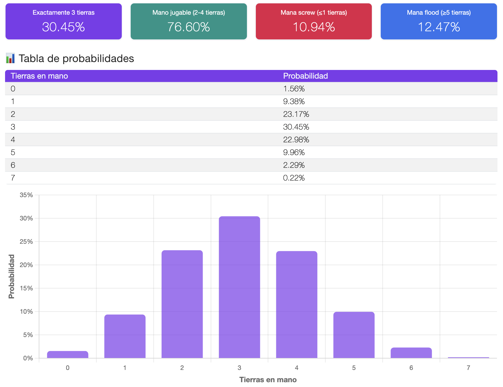
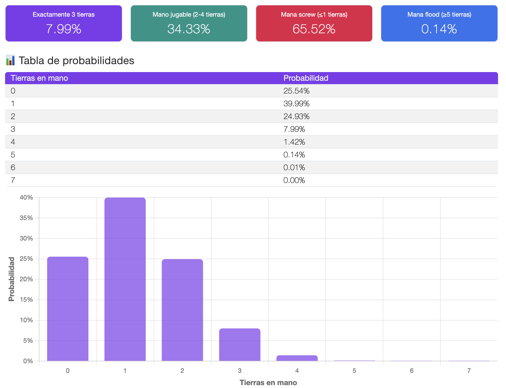

<link rel="stylesheet" href="/assets/css/mtg-calculator.css">


# Me quedo... ¿O no? (Introducción)

Llevo alrededor de 1 año jugando _**commander**_, un formato de _**Magic: The Gathering**_ (MTG). Este es un formato _singleton_ (salvo tierras básicas) con un mazo conformado por 99 cartas y 1 comandante que sigue una identidad de color(es). Puedes leer más al respecto en el [sitio oficial](https://magic.wizards.com/en/formats/commander).

Dada la cantidad de cartas (99), al momento de _"cocinar"_ un mazo es importante tener en cuenta el número de tierras por agregar, pues generalmente éstas conforman el motor principal de maná, claro, sin considerar _"mana stones"_ o _"mana dorks"_. Además, es importante mencionar que MTG utiliza el [_"London mulligan"_](https://magic.wizards.com/en/news/announcements/london-mulligan-2019-06-03), siendo que este tipo de mulligan va penalizando al ir regresando cantidad de cartas de tu mano inicial al fondo del mazo de acuerdo a la cantidad de mulligans que hayas realizado.

Lo anterior usualmente nos hace querer tener una _**"buena mano inicial"**_, casi siempre definida por la cantidad de tierras (y quizás algunos hechizos no tan costosos) para poder ir progresando de manera consistente durante los primeros turnos en un juego.

Por supuesto, esta cantidad de tierras iniciales puede depender de nuestra estrategia o de nuestra curva de maná, así como de si también contamos con _"mana stones"_ o _"mana dorks"_ (que en este caso no estaremos considerando). En general, habrá ocasiones en que busquemos robar 3 tierras en nuestra mano inicial, algunas otras veces al menos 2, etc. Esto nos lleva a plantearnos la pregunta recurrente al inciar una partida y robar nuestra mano inicial:

> _**"¿Me quedo o no me quedo con esta mano?"**_

Esta pregunta busca siempre tener una respuesta favorable, por lo que vale la pena quizás ir un poco más atrás y responder otra relacionada (y posiblemente más importante): **¿Cuántas tierras debería incluir en mi mazo para que mi mano inicial sea jugable de forma consistente?**

Aunque muchas respuestas podrían basarse en experiencia, quizás en heurísticas o simplemente en recomendaciones generales (_"juega entre 36 y 38 tierras"_), el objetivo de este post es explorar el problema desde un **punto de vista probabilístico**, utilizando un modelo matemático sencillo e interactivo que sirva como herramienta que puedas utilizar para tu armado de mazos.

# Un experimento aleatorio bien definido

Nuestro problema de interés radica en poder calcular (de alguna manera) la ocurrencia de robar un número de tierras en una mano inicial. Más específicamente, nos interesa responder preguntas como:

- ¿Cuál es la probabilidad de robar exactamente 3 tierras en la mano inicial?
- ¿Cuál es la probabilidad de robar una mano "jugable" (por ejemplo, robar entre 2 y 4 tierras)?
- ¿Qué tan probable es el *mana screw* o el *mana flood*? (Es decir, robar 0 o 1 tierra y 5 o más, respectivamente.)

Para poder proponer una manera de resolver estas preguntas, es necesario considerar un escenario específico. Si bien lo que se presentará a continuación es consistente para otros formatos, consideraremos el caso de **commander**, donde:

- El mazo tiene $N=99$ cartas
- De ellas, $L$ son las tierras en el mazo (por supuesto: $L < N$)
- Robaremos una mano inicial de $n=7$ cartas
- Y finalmente, nos interesa saber cuántas tierras aparecen en esa mano

Ahora, resultará muy relevante señalar que robar una mano inicial en Magic tiene dos características importantes:

1. **Las cartas se roban sin reemplazo.** Esto significa que las cartas no se regresan, lo que no mantiene una probabilidad constante, sino que va cambiando dependiendo del resultado en el robo de cada carta.
2. **El orden no importa, solo la composición de la mano.** Esto es: no importa si robaste tu primera tierra en tu primera o segunda carta, sino que nos interesa conocer cuántas tierras en total robamos en las 7 cartas de la mano inicial.

Esto es relevante porque descarta modelos como la distribución binomial (que asume independencia) y nos lleva directamente a una distribución clásica en probabilidad discreta, la **distribución hipergeométrica**.

# El modelo ideal para robo de tierras

Si lo pensamos, robar una carta del mazo y verificar si es o no una tierra nos llevará a 1 de 2 posibles resultados: _**"éxito"**_ o _**"fracaso"**_ (respectivamente). Esto podría hacernos pensar en experimentos de alguna manera similares, como lanzar una moneda y observar el resultado.

Experimentos como este último reciben el nombre de _ensayos de Bernoulli_, donde podemos realizar múltiples veces el ensayo, observar el resultado y utilizar algún conocimiento matemático para responder preguntas como _"¿cuál es la probabilidad de obtener 3 éxitos (3 caras) en 7 lanzamientos?"_ (por ejemplo utilizando una distribución binomial) o _"¿cuántas veces debo lanzar la moneda hasta obtener el primer éxito (1 cara)?"_ (por ejemplo utilizando una distribución geométrica). Sin embargo, hay una diferencia **radical** (a mi parecer) que puede ser sutil y llevar a algunas personas a la confusión.

Antes de continuar con esta diferencia radical y mostrar una mejor manera de modelar el robo de una carta y verificar si es o no una tierra, me gustaría agregar un apartado que posiblemente ayude a clarificar algunas confusiones que también suelen ser comunes cuando pensamos en probabilidades.

## "Probabilidad" es diferente de resultados en un experimento

Es importante señalar que la cantidad de posibles resultados y la probabilidad de obtener dichos resultados son cosas completamente distintas. Algunas veces, el hecho de tener 2 posibles resultados nos hace pensar que la probabilidad es de $p=0.5$ siempre para cada uno de estos 2 posibles resultados, pero no es así (salvo que la distribución sea uniforme, como en el caso de una moneda).

A primera vista, el caso de una moneda es ideal en el sentido de que tenemos 2 posibles resultados y que la probabilidad, _idealmente_, es de $p=0.5$ (es decir, del 50%) para cada cara, pero habrá muchos experimentos donde no será así.

Por ejemplo, pensemos en el experimento de sacar una pelota de una bolsa con 500 pelotas donde hay dos posibles colores de pelota, blanco y negro. Si la distribución de colores es uniforme y tenemos 250 pelotas blancas y 250 pelotas negras, la probabilidad sería $p_B=0.5$ y $p_N=0.5$ (respectivamente) y el experimento sería similar al de lanzar una moneda, pero... _¿Qué sucedería si fuesen 499 pelotas blancas y solo 1 pelota negra?_

En este caso, aunque los posibles resultados siguen siendo 2, la probabilidad de obtenerlos ha cambiado completamente, pues ahora las probabilidades de sacar uno u otro color serían $p_B=\frac{499}{500}=0.998$ y $p_N=\frac{1}{500}=0.002$ y el experimento no sería un 50-50 (de facto, esto ahora se volvería un absurdo).

## La distribución hipergeométrica

Regresando a la diferencia radical que se presenta entre robar tierras y los ensayos de Bernoulli, al inicio de este post se mencionaron dos características importantes durante el robo de una mano inicial:

1. **Las cartas se roban sin reemplazo.** A diferencia de lanzar una moneda y contar los resultados de _"éxitos"_ obtenidos (p.e. caras), donde en cada lanzamiento utilizamos la misma moneda y no nos importa el resultado anterior porque la probabilidad es constante (no cambia y siempre es $p=0.5$); cuando robamos una carta no sucede lo mismo. En este caso sí importan los resultados anteriores, es decir, no son ensayos independientes. Además, las probabilidades de robo no son constantes, pues cambian y de hecho se ajustan de acuerdo al resultado obtenido. Por ejemplo, pensemos que si mi mazo es de $N=99$ cartas y contiene $L=37$ tierras, para robar mi primera carta de la mano inicial, la probabilidad de robar una tierra sería $p=37/99=0.\overline{37}$. Supongamos que robo una tierra en mi primera carta, ahora la probabilidad de robar mi segunda tierra en la segunda carta sería $p=36/98 \approx 0.3673$. Pensemos ahora que en la primera carta no robé una tierra, la probabilidad de robar mi primera tierra en la segunda carta sería $p=37/98 \approx 0.3775$. Como podemos observar, la probabilidad va cambiando porque las cartas robadas no se devuelven al mazo y robamos de nuevo (en estadística, esto es denominado como reemplazo en un muestreo aleatorio), sino que vamos robando hasta construir los 7 robos de mano inicial. 
2. **El orden no importa, solo la composición de la mano.** Como mencionamos al inicio, si bien los ensayos no son independientes y la probabilidad va cambiando durante cada robo de carta, no nos interesa si las tierras las robamos durante la primera, segunda, o hasta la séptima carta, sino que nos interesa conocer al final cuántas tierras robamos en las 7 cartas de la mano inicial.

Esto nos lleva a omitir las primeras aproximaciones en el uso de modelos como la distribución binomial o geométrica, que parte de ensayos Bernoulli, proponiendo una mejor manera de modelar este tipo de experimentos, utilizando una **distribución hipergeométrica**.

En términos generales, para esta distribución:
- Tenemos una población de tamaño $N$
- De ella, $K$ elementos son _"éxitos"_
- Tomamos una muestra de tamaño $n$ 
- La variable aleatoria $X$ cuenta cuántos éxitos aparecen en la muestra

El modelo para esta distribución, es decir, la función probabilidad de observar exactamente $k$ éxitos es:

$$
\mathbb{P}(X = k) =
\frac{\binom{K}{k} \binom{N - K}{n - k}}{\binom{N}{n}}
$$

Esta será la forma de calcular la probabilidad y en breve veremos cómo se utiliza explorando el caso práctico con el formato _commander_. Si quisieras leer un poco más sobre esta distribución, te recomiendo [este website de Wolfram](https://mathworld.wolfram.com/HypergeometricDistribution.html).

# El caso de commander

Para el caso de _**commander**_, es decir, traduciendo lo anterior a nuestro contexto, para esta distribución tendríamos que:
- Nuestro tamaño de población es $N=99$, pues es el tamaño del mazo.
- Dado que robar una tierra representa un éxito, tendríamos $L$ posibles _"éxitos"_, así, $K=L$ (recordemos que $L$ es el número de tierras que tenemos en el mazo). Para fines prácticos, podemos suponer un caso de $L=37$ tierras en nuestro mazo.
- La muestra que tomaremos será de $n=7$, nuestra mano inicial.
- De ahí nos interesa conocer $X$, cuántas tierras robamos en nuestra primera mano.

Entonces la fórmula se traduce a:

$$
\boxed{
\mathbb{P}(X = k) =
\frac{\binom{L}{k} \binom{99 - L}{7 - k}}{\binom{99}{7}},
\quad k = 0,1,\dots,7
}
$$

Esta fórmula cuenta:
- Todas las manos posibles de 7 cartas (denominador)
- Solo aquellas con exactamente $ k $ tierras (numerador)

Fijando $L=37$ (37 tierras en el mazo), podríamos pensar en casos específicos, como conocer la probabilidad de robar exactamente 2 tierras de una mano inicial, así, tendríamos que $k=2$ y la formulación se traduce a:

$$
\mathbb{P}(X = 2) =
\frac{\binom{37}{2} \binom{99 - 37}{7 - 2}}{\binom{99}{7}} \approx 0.2895
$$

Con esto, ya tenemos una manera de calcular probabilidades para el robo de tierras en nuestra mano inicial.

# ¿Qué probabilidades nos interesan realmente?

Aunque la fórmula nos da la distribución completa, en la práctica solemos buscar resultados más puntuales. 

Por ejemplo, en mi caso, me interesa maximizar la probabilidad de que en mi mano inicial robe exactamente 3 cartas. No más, no menos. Para mí, en la mayoría de los mazos que juego, esta mano representa mi mano ideal. Sin embargo, vale la pena evaluar otros posibles casos, como conocer la probabilidad de tener una "mano jugable", es decir, que en mi mano inicial haya robado de 2 a 4 tierras y también conocer, con la cantidad de tierras que tengo en mi mazo, cuáles son las probabilidades de un _mana screw_ (que haya robado solo 1 tierra o ninguna) y de un _mana flood_ (que haya robado 5 tierras o más). 

Esto lo podemos calcular fácilmente aplicando reglas de probabilidad con la fórmula anterior. Supongamos $L=37$:

- **La probabilidad para mi "mano ideal":**

  $$
  \begin{align} 
    \mathbb{P}(X = 3) &= \frac{\binom{37}{3} \binom{99 - 37}{7 - 3}}{\binom{99}{7}} \\\\
    &\approx 0.2912
  \end{align}
  $$

  Es decir, la probabilidad de robar mi "mano ideal" es de 29.12% si tengo 37 tierras en mi mazo.

- **La probabilidad para una "mano jugable":**

  $$
  \begin{align} 
    \mathbb{P}(2 \le X \le 4) &= \sum_{k=2}^{4} \mathbb{P}(X = k) \\\\
    &= \mathbb{P}(X = 2) + \mathbb{P}(X = 3) \\
    &\hspace{0.5cm} + \mathbb{P}(X = 4) \\\\
    &\approx 0.7484
  \end{align}
  $$

  Es decir, la probabilidad de robar una "mano jugable" es de 74.84% si tengo 37 tierras en mi mazo.

- **La probabilidad para un _mana screw_:**

  $$
  \begin{align} 
    \mathbb{P}(X \le 1) &= \sum_{k=0}^{1} \mathbb{P}(X = k) \\\\
    &= \mathbb{P}(X = 0) + \mathbb{P}(X = 1) \\\\
    &\approx 0.1858
  \end{align}
  $$

  Es decir, la probabilidad de obtener un _mana screw_ es de 18.58% si tengo 37 tierras en mi mazo.

- **La probabilidad para un _mana flood_:**

  $$
  \begin{align} 
    \mathbb{P}(X \ge 5) &= \sum_{k=5}^{7} \mathbb{P}(X = k) \\\\
    &= \mathbb{P}(X = 5) + \mathbb{P}(X = 6) \\
    &\hspace{0.5cm} + \mathbb{P}(X = 7) \\\\
    &\approx 0.0657
  \end{align}
  $$

  Es decir, la probabilidad de  obtener un _mana flood_ es de 6.57% si tengo 37 tierras en mi mazo.

Estas cantidades resumen muy bien el comportamiento del mazo en la mano inicial, dado un número de tierras dentro de mis 99. A partir de aquí, podemos comenzar a explorar y comprender mejor estos resultados cuando modificamos la cantidad base de tierras en nuestro mazo.

# Interpretación de resultados (más allá de los números)

La parte interactiva de este post reside en la calculadora presentada al inicio. Esta calculadora recibe 3 parámetros para poder realizar los cálculos de probabilidades como hemos hecho hasta ahora. Los parámetros son: cantidad de cartas en el mazo ($N$), cantidad de tierras en el mazo ($L$) y el número de cartas robadas ($n$).

La calculadora nos devuelve un cálculo de probabilidades de interés, una tabla con la probabilidad para cada valor de $k$ (con $k \in \\{ 1, 2, ..., 7 \\}$) y un gráfico con la probabilidad para cada dicho $k$. Este último gráfico nos permite identificar mejor (de manera visual) las probabilidades para cada uno de los valores de $k$. Recordemos que $k$ representa el número de tierras robadas en la mano inicial.

Por ejemplo, veamos el caso para $L=37$ tierras en el mazo:

De la calculadora podemos observar que hemos obtenido las probabilidades de interés que previamente calculamos, sin embargo podemos observar que también se ha obtenido una tabla de probabilidades. Esta tabla contiene los valores para cada valor de $k$ de manera individual. Por ejemplo, podemos observar que para $k=0$, es decir, que se hayan robado 0 cartas en la primera mano, la probabilidad de ocurrencia es de $\approx 0.0330$, es decir, del 3.30%. Similarmente para el resto de valores $k$ de 1 a 7.

Algo interesante que podemos observar es que del gráfico, parece ser que el valor de $k$ con la probabilidad más alta de ocurrencia es en $k=3$ (muy ligeramente por encima de $k=2$, pues las barras se perciben muy similares). Esto nos indica que para $L=37$ tierras en el mazo, la probabilidad de obtener 2 o 3 tierras exactamente es similar, pero ligeramente mayor en 3.

Ahora, veamos un caso con más tierras en el mazo, considerando $L=43$ tierras:

En este resultado, nuevamente observamos las probabilidades calculadas. Algo interesante, en contraste con el caso de $L=37$, es que la probabilidad de obtener exactamente 3 tierras y de tener una "mano jugable" han aumentado debido a tener más tierras en el mazo. Sin embargo, aunque la probabilidad del _mana screw_ ha disminuido, también podemos observar que la probabilidad del _mana flood_ ha aumentado.

En cuanto al gráfico de barras, a diferencia del anterior, hay un mayor contraste que nos permite identificar de mejor manera la barra más alta en el valor de $k=3$. La interpretación es similar al caso anterior, pero otra forma de ver también este resultado es el siguiente: podemos pensar que el valor más probable a obtener es el que tiene una barra más alta, siendo 3 para este caso. De aquí, podemos pensar que si tenemos $L=43$ tierras, el número más probable de tierras que podríamos obtener de robar 7 cartas es 3. 

Muchas veces lo que buscamos es maximizar la probabilidad de obtener $k$ tierras (p.e. obtener $k=3$ tierras), mientras que al mismo tiempo buscamos tener el mínimo número de tierras en el mazo para poder disponer de dichos espacios para otros hechizos.

Finalmente, veamos un caso más contrastado, con $L=17$ tierras en el mazo:

Del gráfico para este caso es muy sencillo identificar la barra más alta, es decir, el valor más probable de ocurrir. En este caso es $k=1$, lo que interpretamos como que será muy probable robar 1 sola tierra en mano inicial si tenemos 17 tierras en el mazo. 

De la tabla de probabilidades podemos observar que los valores más probables de ocurrir son 1, 0 y 2 (en ese orden); y de los valores de probabilidades relevantes podemos notar que la probabilidad de obtener un _mana screw_ es un valor considerablemente alto, con un 65.52% de probabilidad. Esto nos indica que probablemente más de la mitad de las veces robemos sólo 1 tierra o ninguna. En su contraparte podemos observar que la probabilidad de obtener un _mana flood_ es de 0.14%, es decir, muy rara vez podríamos llegar a obtener 5 o más tierras en nuestra mano inicial.

Algunas observaciones útiles al experimentar con la calculadora y analizar los resultados anteriores:

- Aumentar el número de tierras **reduce el riesgo de _mana screw_**, pero incrementa la **probabilidad de _mana flood_**
- La probabilidad de **robar exactamente 3 tierras suele maximizarse alrededor de 36–38 tierras**, considerando que a la vez nos interesa minimizar también la cantidad de tierras en el mazo para disponer de esos espacios para otras cartas
- No existe una configuración "perfecta", sino que generalmente tenemos un **trade-off**, que puede depender de la estrategia y quizás considerar otros elementos como la presencia de _mana stones_ o _mana dorks_, o tener una curva de maná "baja" u optimizada para tu estrategia

Esto refleja una idea central presente en el diseño de algunos juegos y en probabilidad:
> Optimizar una métrica casi siempre implica sacrificar otra.

# Conclusiones

Como hemos visto, este análisis se enfoca únicamente en la **mano inicial**, y no considera:

- _Ramp_, _cantrips_ o posibles robos adicionales que pudiéramos tener de mano inicial
- Alguna curva de mana específica

Aun así, el modelo es útil como una **línea base objetiva** sobre la cual podemos tomar decisiones informadas al momento de armar un mazo. En este sentido, el análisis probabilístico aquí presentado nos ayuda a:

- Entender y mejorar nuestras decisiones de construcción de mazos
- Diseñar mazos más consistentes
- Cuestionar heurísticas o sugerencias comunes, como el clásico _"38 es mi número mágico, bro"_

Al final, con este análisis pretendo compartir un poco de formalismo matemático que puede ser empleado para el armado de mazos.

En fin, espero que este post te haya resultado interesante y que la herramienta te sea de utilidad.

¡Éxito en tu armado de mazos y feliz año nuevo! 🥳

***

### SOBRE EL USO DE INFORMACIÓN TOTAL O PARCIAL: 🔐
* Estos documentos fueron originalmente creados por el autor.
* Cualquier uso de estos documentos o sus contenidos están permitidos a través de la licencia provista y sus condiciones.
* Para cualquier aclaración, puedes contactar al autor: <https://rodolfoferro.xyz/>

**Copyright (c) 2026 Rodolfo Ferro**
